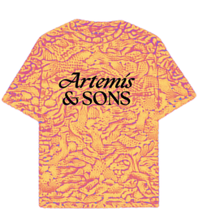
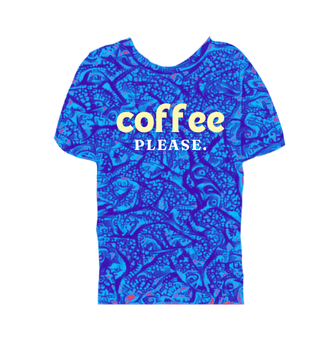
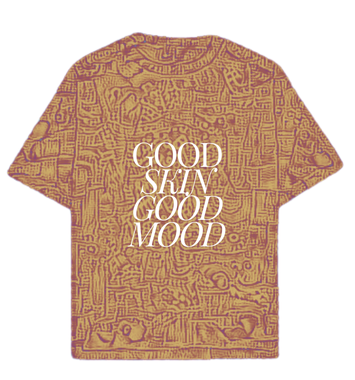
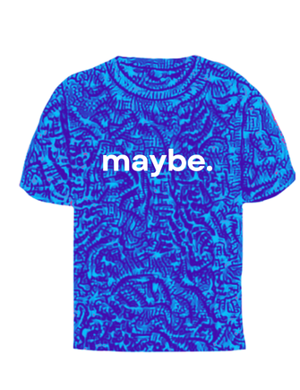
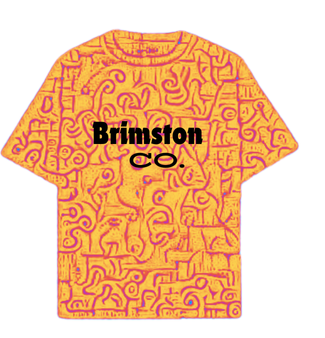

# heritage-buzz
Welcome to Heritage Buzz! This project is all about merging the beauty of 1000-year-old Indian art with the simplicity and elegance of Western fashion, creating chic, ethnic designs that appeal to the modern Gen-Z aesthetic.

## Introduction
Heritage Buzz is a groundbreaking project that reimagines traditional Indian art forms, such as Kalamkari, Madhubani, and Gond, by integrating them into contemporary Western clothing. Our aim is to create unique, stylish outfits that not only honor ancient cultural heritage but also resonate with today's fashion-forward youth.

## Features
Artistic Fusion: Seamlessly blends traditional Indian art with modern Western fashion.

Gen-Z Appeal: Designs specifically curated to match the tastes and preferences of Gen-Z.

High-Quality Graphics: Utilizes advanced graphic design tools to ensure each piece is visually stunning.

## Technology Stack
AI Integration: Custom AI models for design fusion

Web Development: React, Three.js

Backend: Node.js, Express, Flask, Firebase

## Features
Explore Designs: Browse through our collection of chic ethnic designs.

Customize: Use the customization tool to create your own unique outfit by selecting different art forms and base designs.

  
  
  
  
  

